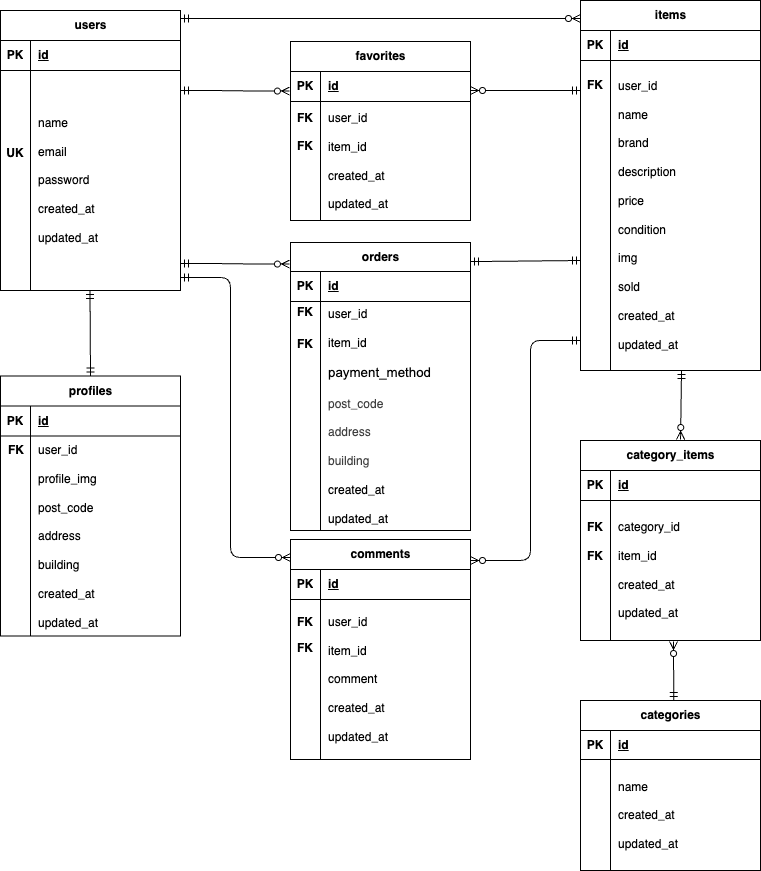

# free-market-app(フリマアプリ)

## 環境構築
**Dockerビルド**
1. `git clone git@github.com:sara-1003/free-market-app.git`
2.  DockerDesktopアプリを立ち上げる
3. `docker-compose up -d --build`

> *MacのM1・M2チップのPCの場合、`no matching manifest for linux/arm64/v8 in the manifest list entries`のメッセージが表示されビルドができないことがあります。
エラーが発生する場合は、docker-compose.ymlファイルの「mysql」内に「platform」の項目を追加で記載してください*
``` bash
mysql:
    platform: linux/x86_64(この文追加)
    image: mysql:8.0.26
    environment:
```

**Laravel環境構築**
1. `docker-compose exec php bash`
2. `composer install`
3. 「.env.example」ファイルを 「.env」ファイルに命名を変更。または、新しく.envファイルを作成
4. .envに以下の環境変数を追加
``` text
DB_CONNECTION=mysql
DB_HOST=mysql
DB_PORT=3306
DB_DATABASE=laravel_db
DB_USERNAME=laravel_user
DB_PASSWORD=laravel_pass
```
5. アプリケーションキーの作成
``` bash
php artisan key:generate
```
6. マイグレーションの実行
``` bash
php artisan migrate
```
7. シーディングの実行
``` bash
php artisan db:seed
```

### 単体テスト(PHPUnit)の環境構築
※ 本セクションは環境構築完了後に実施してください
1. `docker-compose exec mysql bash`
2. `mysql -u root -p`
3. `CREATE DATABASE demo_test;`
4. テスト用DB接続設定の追加
``` text
'mysql_test' => [
    'driver' => 'mysql',
    'host' => env('DB_HOST', '127.0.0.1'),
    'port' => env('DB_PORT', '3306'),
    'database' => 'demo_test',
    'username' => 'root',
    'password' => 'root',
    'charset' => 'utf8mb4',
    'collation' => 'utf8mb4_unicode_ci',
],
```
5. 「.env」ファイルを複製し 「.env.testing」ファイルに命名を変更。
6. .env.testingに以下の環境変数を追加
``` text
APP_NAME=Laravel
APP_ENV=test
APP_KEY=
APP_DEBUG=true
APP_URL=http://localhost

DB_CONNECTION=mysql_test
DB_HOST=mysql
DB_PORT=3306
DB_DATABASE=demo_test
DB_USERNAME=root
DB_PASSWORD=root
```
7. アプリケーションキーの作成
``` bash
php artisan key:generate --env=testing
```
8. マイグレーションの実行
``` bash
php artisan migrate --env=testing
```

9. テストの実行
``` bash
vendor/bin/phpunit
```

## 使用技術（実行環境）
- Laravel 8.83.29
- PHP 8.1.33
- MySQL 8.0.26
- Nginx 1.21.1
- phpMyAdmin phpmyadmin/phpmyadmin
- MailHog mailhog/mailhog

## ER図


## URL
- 開発環境:http://localhost/
- phpMyAdmin: http://localhost:8080/